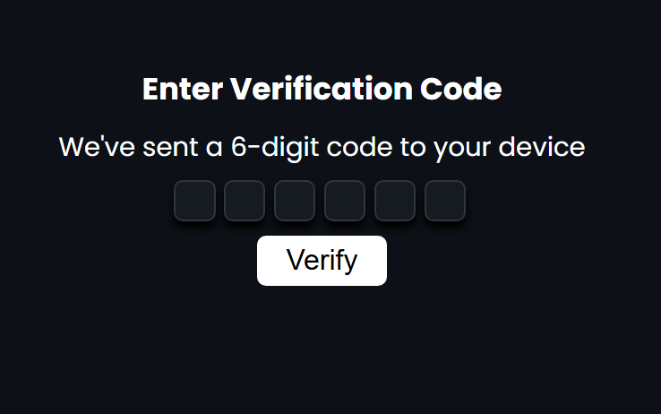

# 🔐 OTP Verification UI

A simple UI/UX design that mimics an OTP (one-time password) verification screen. After verification, it takes you to the My Leno app.

🔗 **Live Site:** [otp-authen.netlify.app](https://otp-authen.netlify.app/)

## Screenshot



## How It Works

1. Open the page to see the OTP verification screen.
2. The page gives you the verification code.
3. Enter the code to verify.
4. After verification, you are taken to the My Leno page.

> ⚠️ This is a front-end demo only. No real OTP is sent, and no real authentication happens.

## Built With

- HTML5
- CSS3
- JavaScript

## Getting Started

```bash
git clone https://github.com/PriestEmma/OTP-auth.git
cd OTP-auth
```

Then open `index.html` in your browser.

---

Built by [Emma](https://github.com/PriestEmma) · [LinkedIn](https://www.linkedin.com/in/priestemma001)
